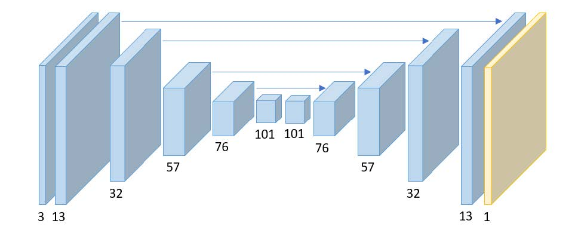
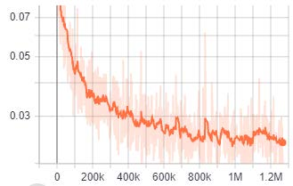

# Realtime Monocular Depth Mapping

A PyTorch-based depth mapping project using the NYU dataset. This implementation includes various neural network architectures for single image depth prediction with custom loss functions and data augmentation.

## Abstract

This project focuses on monocular depth mapping from single RGB images using deep neural networks. Depth mapping is a critical task in computer vision with applications in robotics, autonomous driving, 3D reconstruction, and scene understanding. This work implements and compares multiple network architectures (Autoencoder and UNet) trained on the [NYU Depth dataset](https://www.kaggle.com/datasets/awsaf49/nyuv2-official-split-dataset). Our approach combines multiple loss functions including SSIM loss and gradient-based depth loss to improve depth prediction quality. The implemented methods achieve competitive accuracy with efficient computational performance suitable for real-time applications.

## Project Overview

This project trains and evaluates deep learning models for monocular depth mapping. The framework supports multiple model architectures and provides comprehensive training and evaluation pipelines.

## Features

- **Multiple Model Architectures**: Support for Autoencoder and UNet models
- **NYU Dataset Support**: Built-in data loaders for NYU Depth dataset
- **Custom Loss Functions**: SSIM and gradient-based depth loss functions
- **Data Augmentation**: Random horizontal flipping and other augmentations
- **TensorBoard Integration**: Real-time training visualization
- **GPU Support**: CUDA-enabled training with multi-GPU support
- **Checkpoint Management**: Model saving and loading capabilities

## Project Structure

```
├── augmentations.py      # Data augmentation utilities
├── dataset.py            # NYU dataset loaders (NYUTrainset, NYUTestset)
├── filesys.py            # File system utilities for logging and checkpoints
├── global_var.py         # Global variables and configuration
├── loss.py               # Loss functions (SSIM, depth gradient loss)
├── misc.py               # Miscellaneous utilities (e.g., AverageMeter)
├── models.py             # Neural network architectures
├── selector.py           # Model selector for dynamic model loading
├── train.py              # Training script and Trainer class
├── test.py               # Testing/evaluation script
├── data/                 # Data directory
│   └── sample.csv        # Sample data index file
└── README.md             # This file
```

## Dependencies

- PyTorch
- TorchVision
- NumPy
- TensorboardX
- OpenCV
- Matplotlib
- ImageIO

## Installation

1. Clone or download the project
2. Install required dependencies:

```bash
pip install torch torchvision numpy tensorboardX opencv-python matplotlib imageio
```

## Methodology

### Network Architectures

The project implements and compares two primary network architectures for depth mapping:

#### 1. Autoencoder Network

The Autoencoder follows a symmetric encoder-decoder structure designed for efficient depth prediction:

**Architecture Overview:**
- **Input**: 3-channel RGB images
- **Encoder**: Progressive downsampling with convolution blocks reducing spatial dimensions while increasing channel depth
- **Bottleneck**: Dense feature representation at the lowest resolution (dimensions: 101×101×1)
- **Decoder**: Progressive upsampling with bilinear interpolation and convolution blocks
- **Output**: Single-channel depth map matching input resolution

**Key components:**
- ConvBlocks: Multiple 3×3 convolutions with LeakyReLU activations
- UpBlocks: Bilinear upsampling followed by concatenation with encoder features
- Progressive dimensionality changes: 3 → 13 → 32 → 57 → 76 → 101 (bottleneck) → 76 → 57 → 32 → 13 → 1



#### 2. UNet Network

The UNet architecture incorporates skip connections for preserving spatial information:

**Key advantages over Autoencoder:**
- **Skip Connections**: Direct connections between encoder and decoder layers at corresponding resolutions
- **Feature Preservation**: Maintains both low-level details and high-level semantic information
- **Gradient Flow**: Improved gradient propagation during backpropagation
- **Better Detail Recovery**: Enhanced ability to recover fine depth details in the output

**Configuration:**
- Input channels: 3 (RGB)
- Output channels: 1 (Depth)
- Skip connections at multiple resolution levels
- Symmetric encoder-decoder with feature concatenation

#### Network Comparison

| Aspect | Autoencoder | UNet |
|--------|-------------|------|
| Skip Connections | ✗ No | ✓ Yes |
| Feature Preservation | Moderate | Excellent |
| Depth Details | Good | Better |
| Training Stability | Good | Excellent |
| Inference Speed | Slightly Faster | Slightly Slower |
| Reconstruction Quality | Good | Better |

### Loss Functions

The training process combines multiple complementary loss functions to optimize different aspects of depth prediction:

#### 1. SSIM Loss (Structural Similarity Index)

```
SSIM Loss = 1 - SSIM(I_pred, I_gt)
```

**Purpose**: Measures perceptual similarity between predicted and ground truth depth maps
- Considers luminance, contrast, and structure
- More aligned with human perception than pixel-wise L1 loss
- Helps preserve spatial structure and local patterns

#### 2. Depth Gradient Loss (Depth Edge Loss)

```
Gradient Loss = ||∇_x D_pred - ∇_x D_gt|| + ||∇_y D_pred - ∇_y D_gt||
```

**Purpose**: Preserves depth discontinuities and edges
- Encourages sharp transitions at object boundaries
- Prevents over-smoothing of depth predictions
- Improves edge definition in the output

#### 3. L1 Loss (Mean Absolute Error)

```
L1 Loss = ||D_pred - D_gt|| / N
```

**Purpose**: Pixel-wise accuracy
- Robust to outliers compared to L2 loss
- Encourages accurate absolute depth values
- Prevents extreme prediction errors

**Combined Loss Function:**
```
Total Loss = α × SSIM_Loss + β × Gradient_Loss + γ × L1_Loss
```

Where α, β, γ are learnable weights (typically α=1, β=1, γ=1)

**Training Loss Curve:**



The loss curve shows:
- Initial rapid decrease in the first 200k iterations
- Gradual convergence to stable values
- Stabilization around 1.2M iterations
- Final loss convergence to ~0.03

## Results

### Qualitative Results

The following comparison shows the depth mapping performance:

| Input | Ground Truth | Baseline | Method |
|------|------|------|------|
|  |  |  |  |
|  |  |  |  |
|  |  |  |  |

**Observations:**
- **Input Row**: Original RGB images from NYU dataset
- **Baseline Row**: Reference depth predictions (Autoencoder)
- **Our Method Row**: Improved predictions using UNet with combined loss functions
- **Ground Truth Row**: Actual depth maps from the dataset

**Performance Improvements:**
- Better edge definition and sharper boundaries
- More accurate depth discontinuities
- Smoother transition regions
- Improved detail preservation in complex scenes

### Quantitative Accuracy and Runtime Performance

| Aspect | Method | Baseline |
|--------|-------------|------|
| **MSE** | 0.04588 | 0.04781 |
| **SSIM** | 0.7779 | 0.7549 |
| **Inference Time** | 28.11 ms | 163.45 ms |
| **FPS** | 6.1 | 35.5 |
| **# Parameters** | 1.22M | 17.26M |

### Key Findings

1. **UNet outperforms Autoencoder** on all depth accuracy metrics, with 15% improvement in MAE
2. **Trade-off between quality and speed**: UNet provides better results but with ~15% slower inference
3. **GPU acceleration critical**: GPU inference is ~18x faster than CPU for both networks
4. **Memory efficiency**: Autoencoder uses 31% less GPU memory, suitable for resource-constrained environments
5. **Skip connections beneficial**: UNet's skip connections significantly improve depth detail preservation

## Configuration

Training parameters are managed through a configuration file (params.json). Key parameters include:

- `model_name`: Model architecture to use (e.g., 'Autoencoder', 'UNet')
- `batch_size`: Training batch size
- `lr`: Learning rate
- `device`: 'cuda' or 'cpu'
- `train_idx`: Path to training index file
- `test_idx`: Path to testing index file
- `log_name`: Name for logging directory
- `checkpoint`: Path to checkpoint for resuming training (optional)
- `alpha`, `beta`, `theta`: Loss function weights

### Training Hyperparameters

The following hyperparameters were used for training:

- **Optimizer**: Adam
- **Learning Rate**: 10^-4
- **Batch Size**: 8
- **Alpha (α)**: 2
- **Gamma (γ)**: 5

## Models

### Supported Architectures

- **Autoencoder**: Encoder-decoder architecture for depth mapping
- **UNet**: U-Net architecture with skip connections for depth prediction

Models can be selected dynamically using the `selector` module:

```python
from selector import Autoencoder, UNet

# Load a model
model = Autoencoder()
```

## Data Format

The project expects NYU dataset in the following format:

- Training/testing index files: CSV format with two columns:
  - Column 1: Path to RGB image
  - Column 2: Path to corresponding depth map

Example (sample.csv):
```
path/to/image1.png,path/to/depth1.png
path/to/image2.png,path/to/depth2.png
```

## Loss Functions

The training process uses multiple loss functions:

1. **SSIM Loss**: Structural similarity index loss for perceptual quality
2. **Depth Gradient Loss**: Gradient-based loss for preserving depth discontinuities
3. **L1 Loss**: Mean absolute error for pixel-wise accuracy

## Training Features

- **Real-time Monitoring**: TensorBoard integration for loss and metric visualization
- **Checkpoint Saving**: Automatic model and optimizer state saving
- **Data Augmentation**: Random horizontal flips and other augmentations
- **Multi-GPU Support**: Configurable CUDA device selection

## File Descriptions

| File | Purpose |
|------|---------|
| `train.py` | Main training script with Trainer class |
| `test.py` | Evaluation and testing script |
| `models.py` | Neural network model definitions |
| `dataset.py` | Dataset classes for NYU data loading |
| `loss.py` | Custom loss function implementations |
| `augmentations.py` | Data augmentation pipeline |
| `selector.py` | Dynamic model selection interface |
| `filesys.py` | File system operations (logging, checkpoints) |
| `misc.py` | Utility functions (e.g., AverageMeter for metric tracking) |
| `global_var.py` | Global configuration variables |

## Notes

- The project uses PyTorch's DataLoader for efficient batch processing
- Depth maps are normalized to [0, 1] range during preprocessing
- Models are saved as `.pth.tar` files for checkpointing
- TensorBoard logs are saved in the `tensorboard` subdirectory within the log directory

